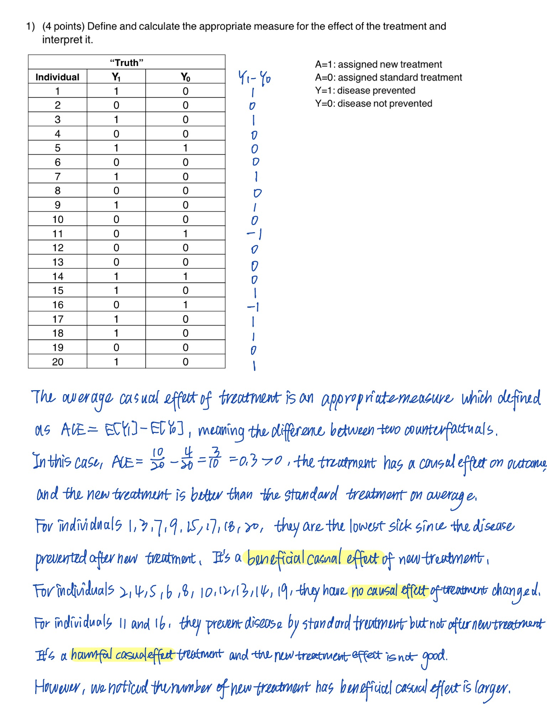

```{r library,message=FALSE, echo=FALSE}
library(ggplot2)
library(remotes)
library(permute)
library(perm)
# install_version("ri", "0.9")
library(ri)
library(dplyr)
library(tidyr)
library(ggdag)
library(dagitty)
library(boot)
```

### Question 1.1

```{r q1,echo=FALSE, out.width="100%"}

```

### Question 1.2 & 1.3

```{r q2,echo=FALSE, out.width="100%"}

```

### Question 1.4

(a) In an observational study, treatment assignment is not controlled by the investigator but is instead determined by other factors, such as patient or doctor choice, underlying health conditions, or other covariates. These factors may lead to confounding, where individuals receiving the new treatment may systematically differ from those receiving the standard treatment. For example, healthier individuals may be more likely to receive the new treatment.

(b) In an randomized controlled trial, treatment assignment is random. This randomization helps ensure that the two groups, new treatment and standard treatment, are balanced in terms of both observed and unobserved covariates. As a result, any difference in outcomes can be more confidently attributed to the treatment itself, reducing the potential for confounding.

### Question 1.5

Based on the data in Study 1, we can rule out randomized controlled trial because the observed treatment effect would reflect a more accurate estimate of the true treatment effect due to randomization. And it needs to satisfy individualistic, probabilistic, unconfounded, and controlled by design. In addition, we do not know how the individuals were assigned to treatments, especially whether the assignment was random or based on other factors, it is impossible to rule out either design just based on the observed data. Furthermore, since the sample size is relatively small, and some assignments might violate the positivity or exchangability assumption.

### Question 1.6

Loading Data: The dataset contains 20 individuals, with two potential outcomes Y1 represents the outcome (disease prevention) under the new treatment, and Y0 represents the outcome under the standard treatment.

Each individual is classified into one of 4 groups based on their potential outcomes that weak Y1,Y0=(0,0), normal1 as Y1,Y0=(0,1), normal2 as Y1,Y0=(1,0), and strong Y1,Y0=(1,1).

```{r q6 load data}
# load data & classify
individual <- c(1:20)
Y1 <- c(1,0,1,0,1,0,1,0,1,0,0,0,0,1,1,0,1,1,0,1)
Y0 <- c(0,0,0,0,1,0,0,0,0,0,1,0,0,1,0,1,0,0,0,0)

df = cbind(individual,Y1,Y0) |>
  as.data.frame() |>
  mutate(status = ifelse(Y1 == 0 & Y0 == 0, "weak",
                         ifelse(Y1 == 0 & Y0 == 1, "normal1",
                                ifelse(Y1 == 1 & Y0 == 0, "normal2",
                                       ifelse(Y1 == 1 & Y0 == 1, "strong", NA))))) |>
  mutate(status = as.factor(status))

# weak Y1,Y0=(0,0)
df_weak = df |>
  filter(status == "weak")
# normal1 Y1,Y0=(0,1)
df_normal1 = df |>
  filter(status == "normal1")
# normal2 Y1,Y0=(1,0)
df_normal2 = df |>
  filter(status == "normal2")
# strong Y1,Y0=(1,1)
df_strong = df |>
  filter(status == "strong")
```

For each group, 50% of the individuals are randomly selected, and one of their outcomes is set to NA to simulate missing data in real world.

We also randomly assigned 50% of the individuals in each groups for A1 assigned new treatmetn, and the other 50% as A0 that assigned standard treatment.

```{r q6 data setting}
set.seed(8122)

# set 50% rows for NA
weak_y1 <- sample_frac(df_weak,0.5) |> 
  mutate(Y0 = NA)
weak_y0 <- df_weak |>
  filter(!(individual %in% (weak_y1$individual))) |>
  mutate(Y1 = NA)
weak = rbind(weak_y1,weak_y0) |> 
  arrange(individual)
knitr::kable(weak)

norm1_y1 <- sample_frac(df_normal1,0.5) |> 
  mutate(Y0 = NA)
norm1_y0 <- df_normal1 |>
  filter(!(individual %in% (norm1_y1$individual))) |>
  mutate(Y1 = NA)
norm1 = rbind(norm1_y1,norm1_y0) |>
  arrange(individual)
knitr::kable(norm1)

norm2_y1 <- sample_frac(df_normal2,0.5) |> 
  mutate(Y0 = NA)
norm2_y0 <- df_normal2 |>
  filter(!(individual %in% (norm2_y1$individual))) |>
  mutate(Y1 = NA)
norm2 = rbind(norm2_y1,norm2_y0) |>
  arrange(individual)
knitr::kable(norm2)

strong_y1 <- sample_frac(df_strong,0.5) |> 
  mutate(Y0 = NA)
strong_y0 <- df_strong |>
  filter(!(individual %in% (strong_y1$individual))) |>
  mutate(Y1 = NA)
strong = rbind(strong_y1,strong_y0) |> 
  arrange(individual)
knitr::kable(strong)
```


The final data simulating a situation where not all outcomes are observed are showed in the following table:

```{r q6 combine}
df6 = rbind(weak,norm1,norm2,strong) |>
  arrange(individual)
knitr::kable(df6)
```

We can also assign A into this final data:

```{r q6 final}
df_new = df6 |>
  pivot_longer(cols = c ("Y1","Y0"),
               names_to = "A",
               values_to = "Y", 
               values_drop_na =T) |>
  mutate(A = ifelse(A == "Y1", 1, 0))
df_new
```


### Question 1.7

The Sharp null hypothesis: $H_0 : \tau_i = Y_{1i} - Y_{0i} = 0 \quad \text{for all } i$

```{r q7}
A = df_new$A
Y = df_new$Y
status = df_new$status |>
  as.factor() |>
  as.numeric()
T_stat <- mean(Y[A == 1]) - mean(Y[A == 0])
T_stat
```

The observed test statistic is 0.3, meaning that the difference between the treated and control groups is 0.3 in the observed data.

Then, generate all possible randomizations of the treatment assignment under the sharp null hypothesis. The randomization is constrained by the variable status blocks to ensure that the randomization respects the blocking structure.

The randomization distribution shows the distribution of the differences in means under the null hypothesis. The red vertical line corresponds to the quantile associated with the observed p-value.

```{r q7 plot}
Abold_1 = chooseMatrix(8,4)
Abold_1 = t(Abold_1)
ncol(Abold_1)

Abold_2 = chooseMatrix(2, 1)
Abold_2 = t(Abold_2)
ncol(Abold_2)

Abold_3 = chooseMatrix(8, 4)
Abold_3 = t(Abold_3)
ncol(Abold_3)

Abold_4 = chooseMatrix(2, 1)
Abold_4 = t(Abold_4)
ncol(Abold_4)

maxiter=ncol(Abold_1)*ncol(Abold_2)*ncol(Abold_3)*ncol(Abold_4)
maxiter

Abold <- genperms(A, blockvar = status, maxiter = maxiter)

rdist <- rep(NA, times = ncol(Abold))
for (i in 1:ncol(Abold)) {
A_tilde <- Abold[, i]
rdist[i] <- mean(Y[A_tilde == 1]) - mean(Y[A_tilde == 0])
}
pval <- mean(rdist >= T_stat)
pval
quant <- quantile(rdist,probs = 1-pval)
hist(rdist)
abline(v = quant,col="red")
```

In this case, the p-value is 0.1286 < 0.05, we fail to reject the sharp null hypothesis, which suggests that the observed difference is not particularly unusual under the sharp null hypothesis. This means that there is not enough evidence to reject the null hypothesis at the 5% significance level. 

### Question 1.8

```{r q8 point estimate}
T_stat <- mean(Y[A == 1]) - mean(Y[A == 0])
T_stat
```

The point estimate of the treatment effect is the observed test statistic `r T_stat`.

```{r q8 ci}
grid<-seq(-1,1, by=0.02)
p.ci<-rep(NA,length(grid))
rdist_1 <- rep(NA, times = ncol(Abold))
for (i in 1:length(grid)){
  for (k in 1:ncol(Abold)) {
    A_tilde <- Abold[, k]
    rdist_1[k] <- mean(Y[A_tilde == 1]) - mean(Y[A_tilde == 0])+grid[i]
  }
  p.ci[i]<-mean(rdist_1 >= T_stat)
}
cbind(p.ci,grid)

perms.ci <- genperms(A, blockvar = status, maxiter = maxiter)
probs.ci <- genprobexact(A)
c(invert.ci(Y,A,probs.ci,perms.ci,0.025),
  invert.ci(Y,A,probs.ci,perms.ci,0.975))
```

The 95% CI is `r c(round(invert.ci(Y,A,probs.ci,perms.ci,0.025),4),
  round(invert.ci(Y,A,probs.ci,perms.ci,0.975),4))`.
  
### Question 1.9

$\text{ACE} = \overline{Y_{\text{obs}, 1}} - \overline{Y_{\text{obs}, 0}} = \frac{\sum_{i=1}^{N} A_i Y_{1i}}{N_1} - \frac{\sum_{i=1}^{N} (1 - A_i) Y_{0i}}{N_0}$

```{r q9 point}
point_estimate_neyman = sum(Y[A==1])/10 - sum(Y[A==0])/10
point_estimate_neyman
```

The point estimate of Neyman is `r point_estimate_neyman`.

$\widehat{\text{var}}(\widehat{\text{SACE}}) = \frac{S_1^2}{N_1} + \frac{S_0^2}{N_0}$


```{r q9 var}
t_crit = qt(0.975, 9)
var = var(Y[A==1])/10 + var(Y[A==0])/10
var
```

The sample variance is `r var`.

$CI(\text{low}) = \widehat{\text{SACE}} - z^* \sqrt{\widehat{\text{var}}(\widehat{\text{SACE}})},$
$CI(\text{up}) = \widehat{\text{SACE}} + z^* \sqrt{\widehat{\text{var}}(\widehat{\text{SACE}})}$

```{r q9 ci}
CI_low = point_estimate_neyman - t_crit*sqrt(var)
CI_up = point_estimate_neyman + t_crit*sqrt(var)
c(CI_low,CI_up)
```

The 95% CI is `r round(c(CI_low,CI_up),3)`.

### Question 1.10

All methods return the same point estimate of 0.3, but the randomization inference approach yields a slightly narrower confidence interval than Neyman’s approach. However, since the confidence intervals include zero, there is no statistically significant evidence to conclude a positive treatment effect at the 95% confidence level in this case.

### Question 1.11

The scientific question of interest in this observational study is: 

What is the average causal effect (ACE) of the new treatment on disease prevention, adjusting for confounding factors such as white blood cell count (L)? 

This question aims to estimate how much effective the new treatment is compared to the standard treatment, while accounting for the confounding role of WBC count, which may influence both the treatment assignment and the outcome. 

### Question 1.12

Treatment (A): This variable represents whether the individual receives the new treatment or the standard treatment.

White Blood Cell Count (L): This is a confounder, influencing both the likelihood of receiving the new treatment and the likelihood of disease prevention.

Outcome (Y): This represents whether the disease is prevented or not.

```{r q12, width = 8, height = 6}
dag <- dagitty("dag {
  L [exposure] 
  A [exposure]
  Y [outcome]
  
  L -> A
  L -> Y
  A -> Y
}")

# Plot the DAG
ggdag(dag) + 
  theme_dag() +
  ggtitle("DAG: Treatment, WBC Count, and Outcome") +
  theme(plot.title = element_text(hjust = 0.5))
```

### Question 1.13

What does the DAG imply about the crude association? Based on the DAG and
your hypothesis drew, leaving L unadjusted for in your analysis would lead to which of the following situations. Circle your choice and explain the reasoning for your choice.

My choice is 

b) Bias in the estimate such that it overestimates the average causal effect (i.e., the estimate is larger in magnitude than the true causal effect).

Based on the DAG, L is a confounder. Since we do not adjust for L in the analysis, there will be bias in the estimated treatment effect. Specifically, individuals with normal WBC counts (L = 1) are more likely to both receive the new treatment and have better health outcomes. This could make the new treatment appear more effective than it really is. Thus, the crude association would likely overestimate the true causal effect.

### Question 1.14

```{r q14}
data_study3 <- data.frame(
  individual = 1:40,
  Y_A1 = c(1, NA, NA, NA, 1, 0, NA, NA, NA, 0, NA, 1, 1, NA, NA, 1, 1, 1, 1, 1,
           NA, 1, 0, 0, NA, NA, NA, 1, NA, 0, NA, 1, NA, NA, 1, 1, NA, 1, NA, NA),
  Y_A0 = c(NA, 0, 0, 0, NA, NA, 0, 0, 0, NA, 1, NA, NA, 1, 1, NA, NA, NA, NA, NA,
           1, NA, NA, NA, 1, 0, 0, NA, 0, NA, 1, NA, 0, 1, NA, NA, 1, NA, 0, 1),
  A = c(1, 0, 0, 0, 1, 1, 0, 0, 0, 1, 0, 1, 1, 0, 0, 1, 1, 1, 1, 1, 
        0, 1, 1, 1, 0, 0, 0, 1, 0, 1, 0, 1, 0, 0, 1, 1, 0, 1, 0, 0),
  L = c(1, 1, 0, 0, 1, 0, 1, 0, 0, 1, 0, 1, 1, 0, 0, 1, 0, 0, 0, 1, 
        1, 0, 0, 0, 0, 0, 0, 0, 0, 0, 1, 1, 0, 0, 1, 1, 1, 0, 0, 0)
) |>
  mutate(Y_A1=as.numeric(Y_A1),
         Y_A0=as.numeric(Y_A0),
         A=as.numeric(A),
         L=as.numeric(L))
data_study3

pr_L1 = nrow(data_study3[data_study3$L == 1,])/nrow(data_study3)
pr_L0 = nrow(data_study3[data_study3$L == 0,])/nrow(data_study3)
E_A1_L1 <- mean(data_study3$Y_A1[data_study3$A == 1 & data_study3$L == 1], na.rm = TRUE)
E_A0_L1 <- mean(data_study3$Y_A0[data_study3$A == 0 & data_study3$L == 1], na.rm = TRUE)
E_A1_L0 <- mean(data_study3$Y_A1[data_study3$A == 1 & data_study3$L == 0], na.rm = TRUE)
E_A0_L0 <- mean(data_study3$Y_A0[data_study3$A == 0 & data_study3$L == 0], na.rm = TRUE)
ACE = E_A1_L1* pr_L1 + E_A1_L0 * pr_L0 - (E_A0_L1 * pr_L1 + E_A0_L0 * pr_L0)
ACE
```

```{r q14 standardize}
# function to calculate difference in means
standardization <- function(data, indices) {
# create a dataset with 3 copies of each subject
  d <- data[indices, ] # 1st copy: equal to original one`
  d$interv <- -1
  d0 <- d # 2nd copy: treatment set to 0, outcome to missing
  d0$interv <- 0
  d0$A <- 0
  d0$Y <- NA
  d1 <- d # 3rd copy: treatment set to 1, outcome to missing
  d1$interv <- 1
  d1$A <- 1
  d1$Y <- NA
  
  d.onesample <- rbind(d, d0, d1) # combining datasets
  fit <- glm(Y ~ as.factor(A)+as.factor(L)+I(A*L),
             data = d.onesample)
  d.onesample$predicted_meanY <- predict(fit, d.onesample)
  # estimate mean outcome in each of the groups interv=-1, interv=0, and interv=1
  return(c(round(mean(d.onesample$predicted_meanY[d.onesample$interv == -1]),3),
           round(mean(d.onesample$predicted_meanY[d.onesample$interv == 0]),3),
           round(mean(d.onesample$predicted_meanY[d.onesample$interv == 1]),3),
           round(mean(d.onesample$predicted_meanY[d.onesample$interv == 1]) 
                 - mean(d.onesample$predicted_meanY[d.onesample$interv == 0]),3)))
}

data_study3_new = data_study3 |>
  pivot_longer(cols = c ("Y_A1","Y_A0"), values_to = "Y")
data_study3_new

# bootstrap
results <- boot(data = data_study3_new,
                statistic = standardization,
                R = 10)
# generating confidence intervals
se <- c(round(sd(results$t[, 1]),3),
        round(sd(results$t[, 2]),3),
        round(sd(results$t[, 3]),3),
        round(sd(results$t[, 4]),3))
mean <- results$t0
ll <- round(mean - qnorm(0.975) * se,3)
ul <- round(mean + qnorm(0.975) * se,3)

bootstrap <-
  data.frame(cbind(
    c(
      "Observed",
      "No Treatment",
      "Treatment",
      "Treatment - No Treatment"
    ),
    mean,
    se,
    ll,
    ul
  ))
knitr::kable(bootstrap)
```

The estimate for ACE suggests a positive treatment effect, as the estimated difference between treatment and no treatment is positive, which has a value of `r ACE`. However, the lower bound of the confidence interval is 0, which indicates that the treatment effect may not be statistically significant at the chosen confidence level (if the interval includes 0). This suggests that while the treatment shows a positive effect, there is some uncertainty about whether the effect is different from zero.

### Question 1.15

Since NUCA holds and conditional exchangeability is valid, the results of the g-formula and the unadjusted approach in Question 1 are approximately the same. This reinforces the assumption that confounding was adequately controlled through the g-formula and that L was an important measured confounder in the model.

### Question 1.16

```{r q16}
E_A1_L1 * pr_L1 - E_A0_L1 * pr_L1
E_A1_L0 * pr_L0 - E_A0_L0 * pr_L0
```

Since the causal effect is similar between the subset L=1 and the subset L=0, conditional exchangeability holds within the two strata defined by L. Thus, there is strong support for your hypothesis in the data.

### Question 1.17

Conditioning on (B, L and F) would close all back-door paths between A and Y.

### Question 1.18

NUCA (No Unmeasured Confounding Assumption) asserts that after conditioning on observed variables, the treatment assignment A is independent of potential outcomes Y1 and Y0. In a DAG, this translates to the idea that we have adequately blocked all backdoor paths between A and Y by conditioning on the correct set of covariates. In this case, if we successfully condition on the appropriate covariates such as L and F, there are no unmeasured confounders between A and Y, which satisfied the NUCA assumption.

### Question 1.19

We can condition on H to open a closed path from A to Y.

### Question 1.20

Collider: Given a path $\pi$ in a graph G, a non-endpoint vertex $X_j$ on $\pi$ is called a collider if the two edges incident to $X_j$ are both into $X_j$ , i.e., have arrowheads at $X_j$.

Adjusting for a collider opens up pathways that introduce bias. When you condition on a collider, it can create an association between the variables that point into the collider, even if no such association existed before.

H is a collider. In the path A <- L -> H <- F -> Y.

## Question 2

### Question 2.1

Units: The units in this study are hospitals in New York State.

Potential outcomes: The number of doctors from minority backgrounds promoted to leadership positions in each hospital, with and without the workshop.

Treatment: The treatment is whether a hospital received the diversity workshop.

Observed covariates: Observed covariates could include the hospital's baseline percentage of minority doctors, baseline leadership diversity, location, hospital size, and other demographic or socioeconomic factors influencing hospital policies.

### Question 2.2

The causal effect of the diversity workshop on the increase in the number of minority doctors in leadership positions two years after the intervention.

$Casual Effect = E[Y_1-Y_0]$

where $Y_1$ is the number of minority doctors promoted in hospitals that received the diversity workshop and $Y_0$ is the number of minority doctors promoted in hospitals that did not receive the diversity workshop. The causal effect measures the average difference in outcomes between the treated and control hospitals.

### Question 2.3

From the question, since we know that the workshop is assigned to the hospitals with majority of white doctors in leadership positions or requested by hospital administrators. Thus, the study design is not random but is based on observed characteristics.

This design is less than ideal for making causal inferences due to potential confounding, particularly because hospitals that requested the workshop may differ systematically from those that did not. However, if sufficient covariates are measured and controlled, we can use matching, regression adjustment, or instrumental variable analysis to estimate the causal effect more accurately.

### Question 2.4

I would recommend a randomized controlled trial (RCT), where hospitals are randomly assigned to receive the diversity workshop, regardless of their initial composition of leadership. This would help ensure that the treatment and control groups are comparable, minimizing confounding.

Firstly, we should describe the differences in minority leadership promotions between hospitals that received the workshop and those that did not. Then, we can use regression models that adjust for covariates like baseline leadership diversity, location, and hospital size. These models can help control for confounding factors that might affect the relationship between the workshop and the outcome. To adjust for potential biases from the self-selection mechanism, propensity score matching could be used to create comparable groups of hospitals.

